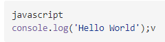
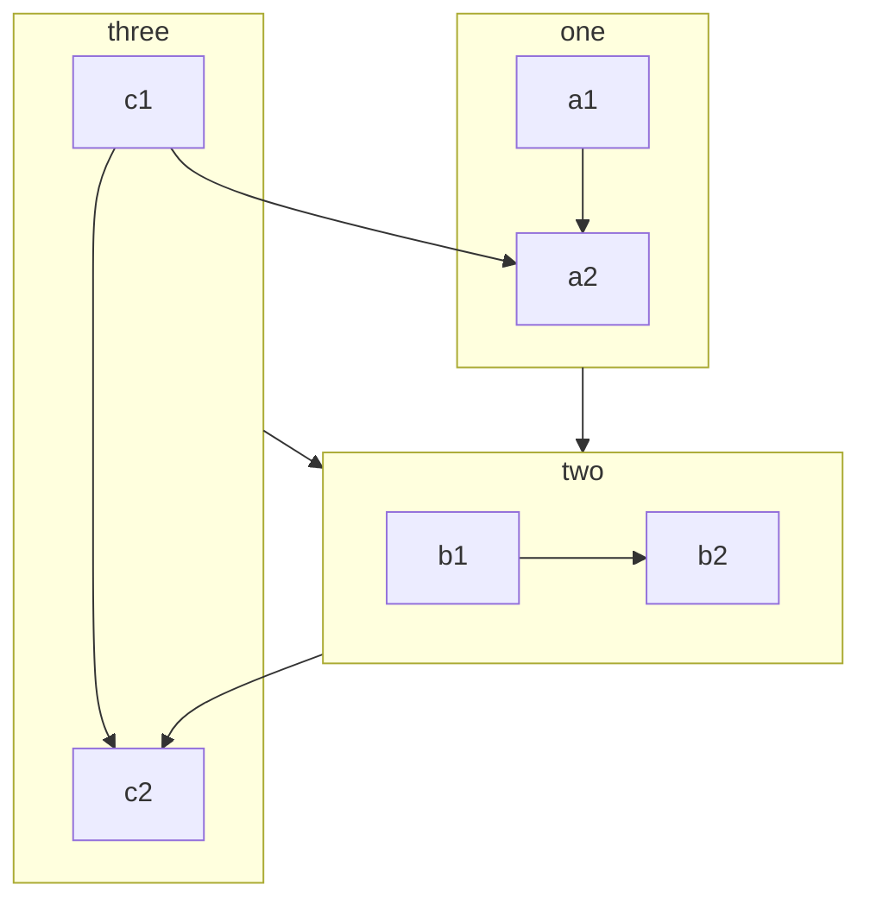
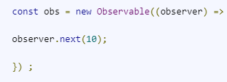
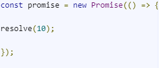
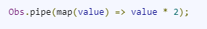
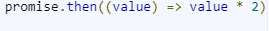
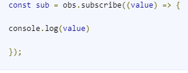
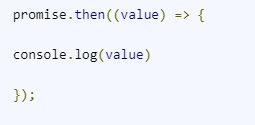
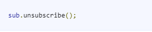

https://www.markdownguide.org/cheat-sheet/ LINK EXP : 

- 

~~gach ngang~~

**bold**

*in nghieng*

>quote '>'

quote  **`nhan manh`**

| STT | Title 1 | Title 2 |
| --- | ------- | ------- |
| 1   | **DI**  | SOLID   |

##code style

```php
<?php
echo 111;
```

```js
javascript
console.log('Hello World');
```
**PAGE BREAK**
```js
<div style="page-break-after: always;"></div>
```
<div style="page-break-after: always;"></div>

**IMAGE**
example :


**-----DIALOG----**

+ *Mermaid*
link : https://mermaid-js.github.io/mermaid/#/flowchart

**MATH**
$(a+b)^2 = a^2 + 2ab + b^2$

**IMPORT FILE**

<div style="background-color:rgba(0, 0, 0, 0.0470588); text-align:center; vertical-align: middle; padding:40px 0;">
<a href="/donate">DONATE</a>
</div>


I need to highlight these <mark>very important words</mark>.
I need to highlight these ==very important words==.
That is so funny! :joy:
<span style="color:blue;font-weight:bold">Make this text blue.</span>
***Compare Observables & Promise***

| Observables                                                                                                                             | Promises                                                                              |
| --------------------------------------------------------------------------------------------------------------------------------------- | ------------------------------------------------------------------------------------- |
| Emit **multiple** values over a period of time.                                                                                         | Emit a **single** value at a time.                                                    |  |
| **Are lazy**: they’re <span style="color:red">not executed</span> until we subscribe to them using the subscribe() method.              | Are **not lazy**: <span style="color:red">executed</span> immediately after creation. |  |
| Have **subscriptions that are cancellable** using the *unsubscribe()* method, which *stops the listener from receiving further values*. | Are not cancellable.                                                                  |  |
| Deliver errors to the subscribers.                                                                                                      | Push errors to the child promises.                                                    |


#####Now let’s see code snippets / examples of a few operations defined by observables and promises.

| Operations  | Observables                  | Promises                                             |
| ----------- | ---------------------------- | ---------------------------------------------------- |
| Creation    |  |                          |
| Transform   |  |                          |
| Subcribe    |  |                          |
| Unsubscribe |  | **<span style="color:red">Can't unsubcribe </span>** |

*link for details* : https://www.syncfusion.com/blogs/post/angular-promises-versus-observables.aspx#:~:text=Both%20observables%20and%20promises%20help,over%20a%20period%20of%20time.